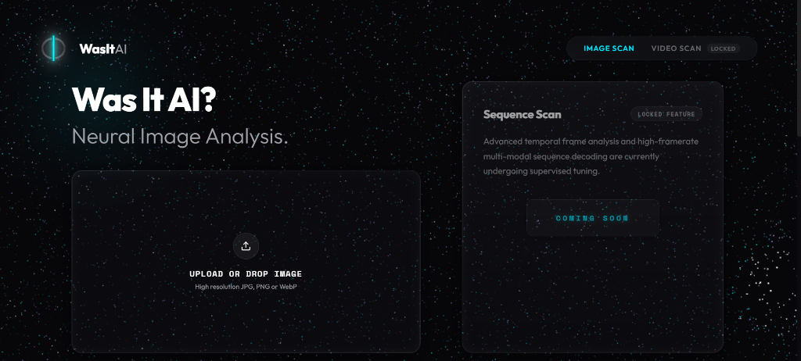
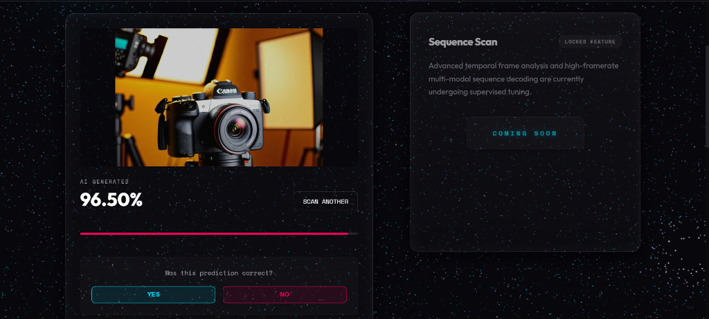

WasItAI: AI-Generated Image Detection System
============================================

WasItAI is a full-stack web application designed to detect whether an image is a real photograph or a synthetic image generated by AI models like Midjourney, Stable Diffusion, and DALL-E.

--------------------------------------------------------------------------------

System Interface
----------------

1. Main Scanning Interface
The application features a clean, dark-mode glassmorphic user interface where users can drag and drop or upload images for analysis.


2. Neural Analysis and Feedback Screen
After the image is processed, the system displays the prediction along with a calibrated confidence score and a feedback form.


--------------------------------------------------------------------------------

Project Overview
----------------

With the rise of generative AI tools, creating hyper-realistic fake images has become extremely simple. This makes it difficult to trust digital media. WasItAI helps solve this problem by analyzing subtle pixel patterns and spatial frequency anomalies in images that are invisible to the human eye.

The core of the system is an optimized EfficientNet-V2-S Convolutional Neural Network (CNN) that achieves over 85 percent accuracy on unseen, in-the-wild test images. The frontend is a React application optimized with Vite, and the backend is a FastAPI server.

--------------------------------------------------------------------------------

Technology Stack and Dependencies
---------------------------------

The project is structured into three main components:

Deep Learning (Core Neural Infrastructure)
- PyTorch and Torchvision: Core neural network framework and tensor execution.
- EfficientNet-V2-S: CNN backbone fine-tuned to extract generative artifacts.
- Pillow and NumPy: Image loading, resizing, and array preprocessing.

Backend API Service
- FastAPI: Asynchronous API for uploads and user feedback.
- Uvicorn: Production-ready ASGI web server.
- Discord Webhook API: Real-time logging of user corrections.

Frontend Client (User Interface)
- React.js (React 18): Single Page Application framework for the user interface.
- Vite: Fast build tool and local development server.
- Framer Motion: Smooth entry animations and state transitions.
- Lucide React: Modern icons for the user interface.

--------------------------------------------------------------------------------

Features and Implemented Pipeline
---------------------------------

1. Automatic Image Classification
When a user uploads an image, the backend automatically resizes it to 256px, performs a center crop to 224px, converts it to a PyTorch tensor, and normalizes it using standard ImageNet values. The model then predicts whether the image is AUTHENTIC or AI.

2. Calibrated Confidence Scores
- Temperature Scaling: The model uses a temperature factor of 8.0 to scale raw outputs. This prevents the model from showing artificial overconfidence.
- Confidence Clipping: The system caps the maximum confidence score at 96.50 percent so that it never claims to be 100 percent sure, which matches real-world scientific uncertainty.

3. Feedback Loop
If the system makes an incorrect prediction, the user can click the NO button. The frontend then automatically sends the correct ground-truth label and the image back to the backend, which saves the file in separate folders named verified_ai and verified_authentic for future retraining.

4. Discord Integration
When corrective feedback is submitted, the backend automatically triggers a post request to a Discord webhook. This sends the misclassified image, the prediction, and the unique image hash directly to a Discord channel for real-time monitoring.

5. Retraining Pipeline with Memory Replay
A standalone training script (train_feedback.py) is included to fine-tune the model on new feedback data:
- Catastrophic Forgetting Prevention: The training script mixes new feedback images with a balanced sample of 2,400 images (1,200 real and 1,200 fake) from the original dataset.
- Surgical Training: The early feature extraction layers are locked. Only the final convolutional block of the backbone and the single-neuron classifier head are trained.

6. Storage Cleanup
The backend runs an automatic background sweeper on startup that deletes feedback files older than 30 days to save server disk space.

--------------------------------------------------------------------------------

How to Install and Run the Project
----------------------------------

Prerequisites
-------------
Make sure you have the following installed:
- Python 3.10 or higher
- Node.js 18.x or higher and npm
- Git

---

1. Setting Up the Backend

Navigate to the backend directory:
```bash
cd backend
```

Create a virtual environment and activate it:
- On Windows (PowerShell):
  ```powershell
  python -m venv venv
  .\venv\Scripts\Activate.ps1
  ```
- On macOS or Linux:
  ```bash
  python3 -m venv venv
  source venv/bin/activate
  ```

Install the required dependencies:
```bash
pip install -r requirements.txt
```

Configure the Discord webhook (Optional):
- On Windows (PowerShell):
  ```powershell
  $env:DISCORD_WEBHOOK_URL="your_webhook_url"
  ```
- On macOS or Linux:
  ```bash
  export DISCORD_WEBHOOK_URL="your_webhook_url"
  ```

Start the FastAPI server:
```bash
python app.py
```
The backend will start at http://localhost:8000. You can view the API documentation at http://localhost:8000/docs.

---

2. Setting Up the Frontend

Open a new terminal window and navigate to the frontend directory:
```bash
cd frontend
```

Install the required packages:
```bash
npm install
```

Start the development server:
```bash
npm run dev
```
Open the local URL (usually http://localhost:5173) in your browser to run the interface.

---

3. Running the Retraining Script

To retrain the model on user feedback:
1. Ensure the baseline training dataset is available in dataset/shutterstock/train/FAKE and dataset/shutterstock/train/REAL.
2. Run the retraining script within your active virtual environment:
   ```bash
   cd backend
   python train_feedback.py
   ```
   This will train the model for 3 epochs with a learning rate of 0.00005 using the AdamW optimizer, saving updated weights to best_model_global.pth.

--------------------------------------------------------------------------------

Academic Team and Project Guidance
----------------------------------

This project was developed as a B.Tech III-Year Minor Project in Computer Science and Engineering at Medi-Caps University, Indore.

Group Members
-------------
- Alaqmar Kanchwala (Enrollment Number: EN23CS301111)
- Ali Asger Ginwala (Enrollment Number: EN23CS301112)
- Ali Saifee (Enrollment Number: EN23CS301113)

Project Mentors and Guides
--------------------------
- Mr. Digendra Singh (Assistant Professor, Department of Computer Science and Engineering)
- Mr. Ashish Shrivastava (Assistant Professor, Department of Computer Science and Engineering)

Institution Details
-------------------
- Department of Computer Science and Engineering
- Faculty of Engineering, Medi-Caps University, Indore - 453331
- Date of Submission: April 2026

--------------------------------------------------------------------------------

License
-------
This project is licensed under the MIT License.
